# SLAM_Box

- [SLAM\_Box](#slam_box)
  - [1. 纯ndt里程计](#1-纯ndt里程计)
  - [2. 基于ESKF的松耦合里程计](#2-基于eskf的松耦合里程计)
  - [SLAM trick](#slam-trick)
    - [Ceres构建SLAM优化问题](#ceres构建slam优化问题)
      - [1. ceres 构建SLAM优化问题](#1-ceres-构建slam优化问题)
      - [2. ceres如何定义自己的cost函数](#2-ceres如何定义自己的cost函数)
      - [3. 自定义优化变量](#3-自定义优化变量)
    - [g2o构建SLAM优化问题](#g2o构建slam优化问题)
    - [GTSAM 构建SLAM优化问题](#gtsam-构建slam优化问题)
      - [GTSAM 如何自定义边](#gtsam-如何自定义边)
      - [以SC-DLO后端优化为例](#以sc-dlo后端优化为例)
    - [ICP实现及其多线程版本](#icp实现及其多线程版本)
  - [Reference](#reference)

## 1. 纯ndt里程计
基于手写的多线程ndt匹配算法实现简单的里程计
<table>
  <thead>
    <tr>
      <th colspan="6">On KITTI Datasets</th>
    </tr>
  </thead>
  <!-- <tbody>
    <tr align="center">
      <td> 00 </td><td> 01 </td><td> 02 </td><td> 03 </td><td> 05 </td><td> 04 </td>
    </tr>
  </tbody> -->
  <tbody>
    <tr>
      <td> 05 </td>
      <td> <p align="center">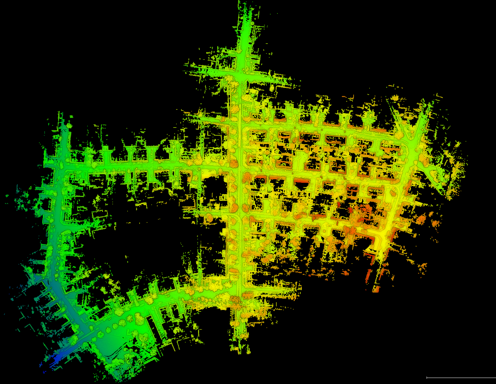</p> </td>
      <td> <p align="center">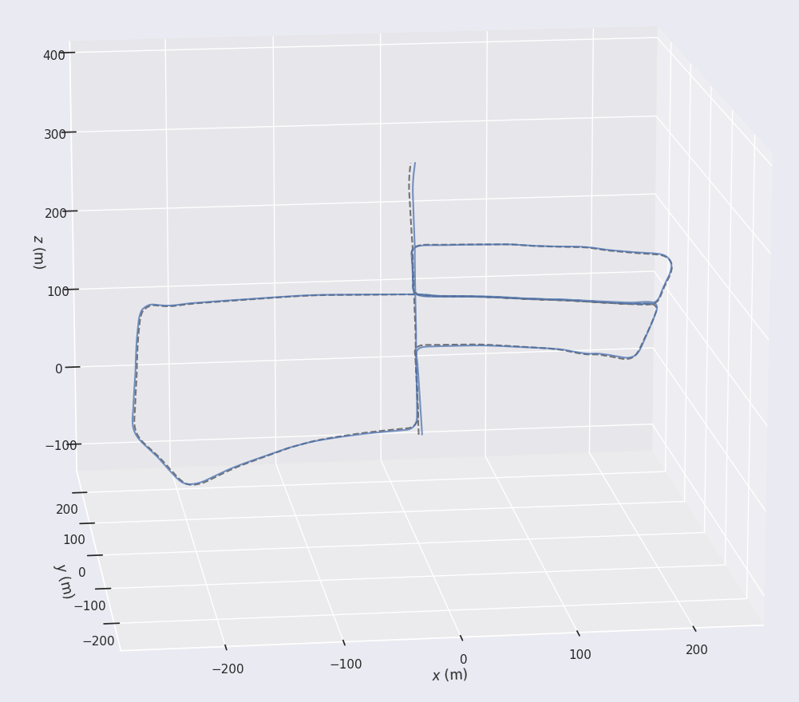</p> </td>
      <td> <p align="center">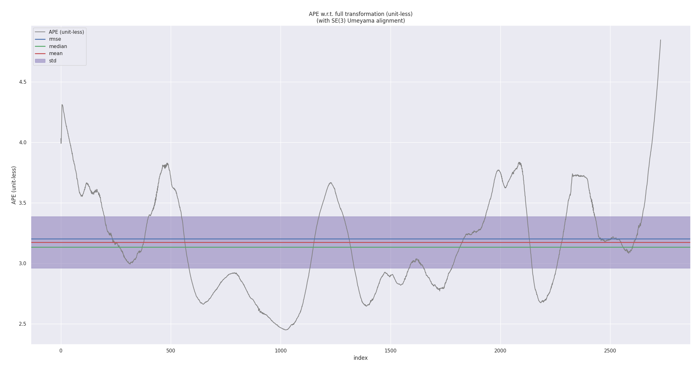</p> </td>
    </tr>
  </tbody>
</table>

## 2. 基于ESKF的松耦合里程计

<table>
  <thead>
    <tr>
      <th colspan="6">Test Results On Datasets</th>
    </tr>
  </thead>
  <!-- <tbody>
    <tr align="center">
      <td> 00 </td><td> 01 </td><td> 02 </td><td> 03 </td><td> 05 </td><td> 04 </td>
    </tr>
  </tbody> -->
  <tbody>
    <tr>
      <th rowspan="3" scope="rowgroup">ulhk</th>
      <th scope="row">ndt_lo</th>
      <td> <p align="center">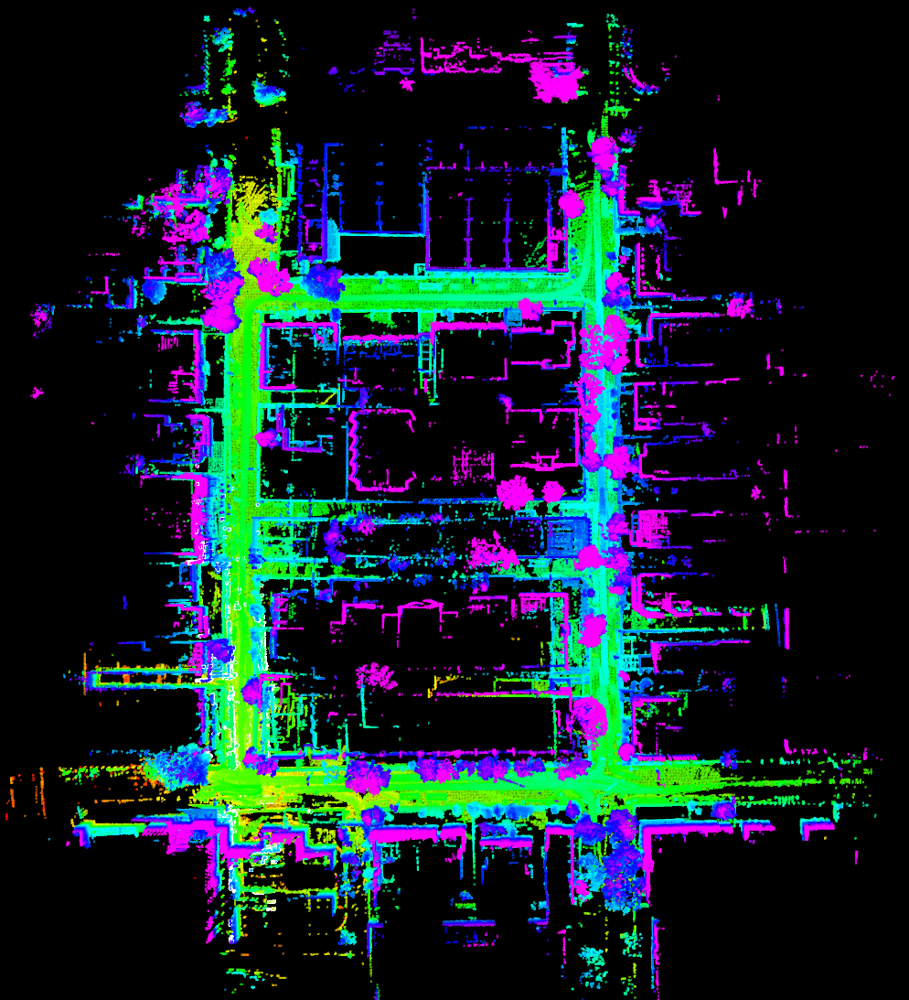</p> </td>
      <td> <p align="center">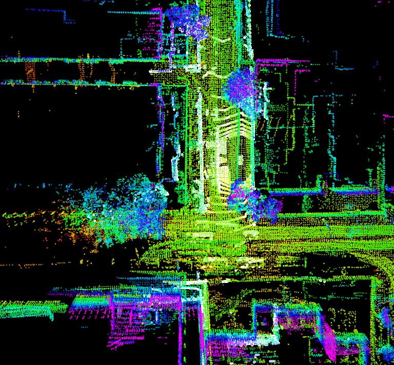</p> </td>
    </tr>
    <tr>
      <th scope="row">loosely_lio</th>
      <td> <p align="center">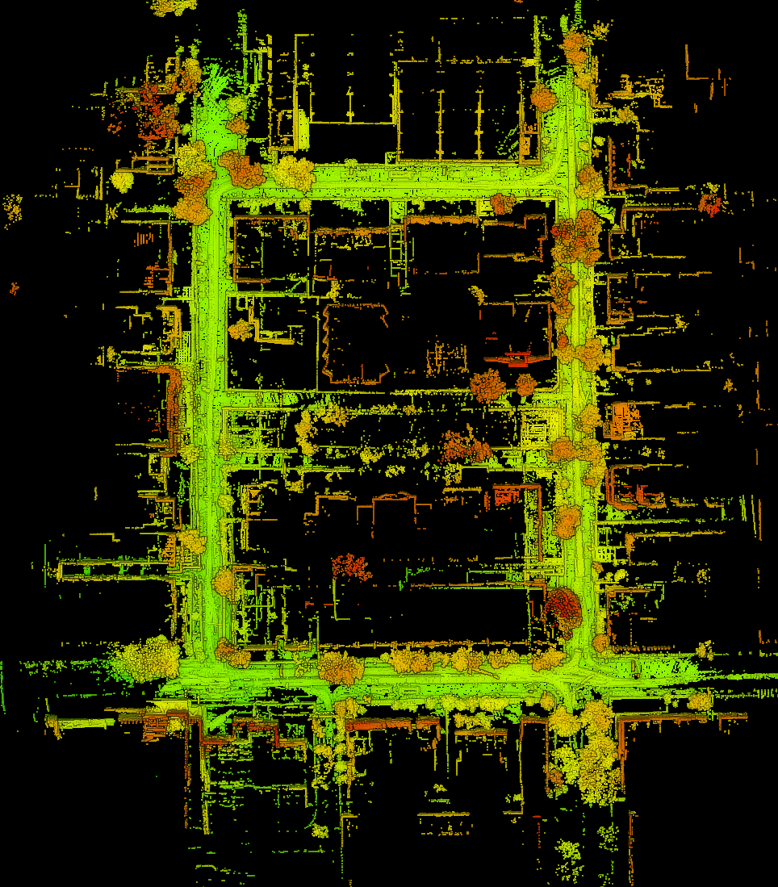</p> </td>
      <td> <p align="center">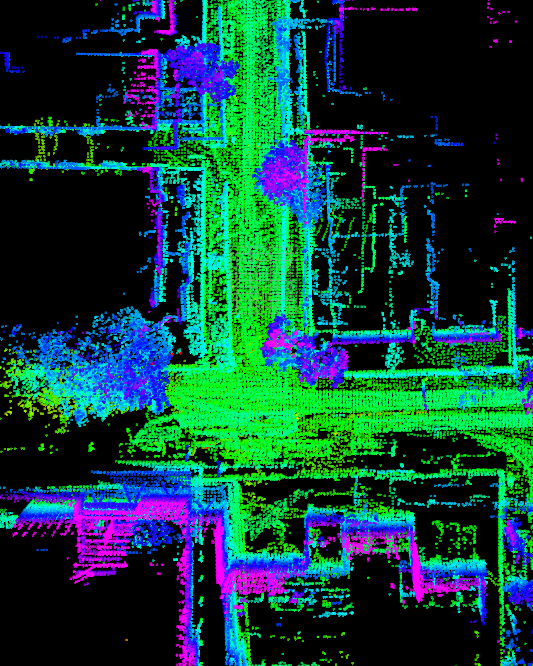</p> </td>
    </tr>
    <tr>
      <th scope="row">dlo</th>
      <td> <p align="center">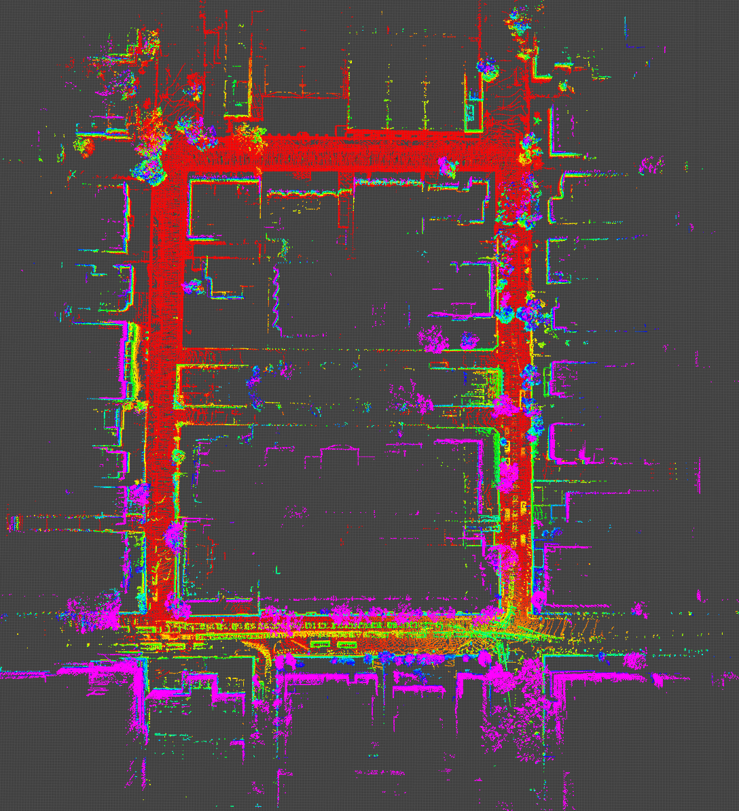</p> </td>
      <td> <p align="center">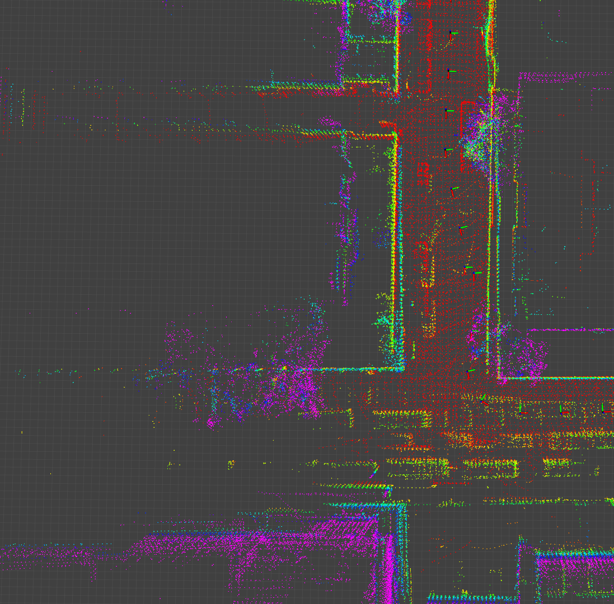</p> </td>
    </tr>
  </tbody>
</table>

## SLAM trick

### Ceres构建SLAM优化问题
#### 1. ceres 构建SLAM优化问题
- 定义损失函数：`ceres::LossFunction`（以`ceres::HuberLoss(0.1)`函数为例）
- 定义优化问题：`ceres::Problem`
- 给问题添加参数块：`problem.AddParameterBlock(parameters, 7, new PoseSE3Parameterization());`，**其中**，`PoseSE3Parameterization()`可以是自定义参数类型，见3.小节；
- 添加代价函数：线点代价函数：`addEdgeCostFactor(downsampledEdgeCloud,laserCloudCornerMap,problem,loss_function);` 和面点代价函数：`addSurfCostFactor(downsampledSurfCloud,laserCloudSurfMap,problem,loss_function);`
- 设置优化参数：`ceres::Solver::Options`
- 求解问题：`ceres::Solve(options, &problem, &summary);`
```C++
        for (int iterCount = 0; iterCount < optimization_count; iterCount++){
            ceres::LossFunction *loss_function = new ceres::HuberLoss(0.1); // doc: 用huber函数减小外点的影响
            ceres::Problem::Options problem_options;
            ceres::Problem problem(problem_options);

            problem.AddParameterBlock(parameters, 7, new PoseSE3Parameterization());    // doc: 显示的添加待优化的参数块
            // info: laserCloudCornerMap 和 laserCloudSurfMap 分别存储的是map的特征点云, 也就是全局地图信息
            addEdgeCostFactor(downsampledEdgeCloud,laserCloudCornerMap,problem,loss_function);
            addSurfCostFactor(downsampledSurfCloud,laserCloudSurfMap,problem,loss_function);

            ceres::Solver::Options options;
            options.linear_solver_type = ceres::DENSE_QR;
            options.max_num_iterations = 4;
            options.minimizer_progress_to_stdout = false;
            options.check_gradients = false;
            options.gradient_check_relative_precision = 1e-4;
            ceres::Solver::Summary summary;

            ceres::Solve(options, &problem, &summary);
        }
```

#### 2. ceres如何定义自己的cost函数
以线点代价函数`EdgeAnalyticCostFunction`为例：
- 继承`ceres::SizedCostFunction<1, 7>`（如果参数块的维度以及残差向量的维度能够在编译时确定，可以使用`SizedCostFunction`类,与CostFunction类相比，SizedCostFunction类通过模板参数确定子参数块的数量、每个子参数块中的参数数量、残差数量，因此，用户只需要override（重写）Evaluate()函数即可，不需要通过调用其他成员函数来指定各参数维度。）；
- `EdgeAnalyticCostFunction`包括自己的成员，需要重新定义构造函数进行初始化；
- 重写虚函数：`~EdgeAnalyticCostFunction`（析构函数有需要才进行具体实现，默认空白`{}`），`virtual bool Evaluate(double const *const *parameters, double *residuals, double **jacobians) const;`

类的声明：
```C++
class EdgeAnalyticCostFunction : public ceres::SizedCostFunction<1, 7> {
	public:

		EdgeAnalyticCostFunction(Eigen::Vector3d curr_point_, Eigen::Vector3d last_point_a_, Eigen::Vector3d last_point_b_);
		virtual ~EdgeAnalyticCostFunction() {}
		virtual bool Evaluate(double const *const *parameters, double *residuals, double **jacobians) const;

		Eigen::Vector3d curr_point;
		Eigen::Vector3d last_point_a;
		Eigen::Vector3d last_point_b;
};
```
重写`Evaluate`函数：
```C++
// 计算残差和雅克比矩阵
// parameters 表示所有参数块的所有参数，是一个指针数组，数组的大小表示参数块的数量，数组中的每个元素又是一个指针，指向另一个数组（子参数块），
// 例如，parameters[i]表示第个子参数块，parameters[i][c]表示第个子参数块中的第个参数；
bool EdgeAnalyticCostFunction::Evaluate(double const *const *parameters, double *residuals, double **jacobians) const
{
    
    Eigen::Map<const Eigen::Quaterniond> q_last_curr(parameters[0]);    // doc: 从数组中直接映射出四元数姿态, parameters[0]是一个 double[] 数组,应该是 7 维
    Eigen::Map<const Eigen::Vector3d> t_last_curr(parameters[0] + 4);   // doc: 从数组中直接映射出平移向量
    Eigen::Vector3d lp;
    lp = q_last_curr * curr_point + t_last_curr; // doc: 将当前点的投影到地图坐标系下

    Eigen::Vector3d nu = (lp - last_point_a).cross(lp - last_point_b);  // doc: 叉乘为面积
    Eigen::Vector3d de = last_point_a - last_point_b;   // doc: 底边长
    double de_norm = de.norm();
    residuals[0] = nu.norm()/de_norm;   // doc: 面积除以底等于高，高就是点到直线的距离
    
    if(jacobians != NULL)
    {
        if(jacobians[0] != NULL)
        {
            Eigen::Matrix3d skew_lp = skew(lp);
            Eigen::Matrix<double, 3, 6> dp_by_se3;
            dp_by_se3.block<3,3>(0,0) = -skew_lp;
            (dp_by_se3.block<3,3>(0, 3)).setIdentity();
            Eigen::Map<Eigen::Matrix<double, 1, 7, Eigen::RowMajor> > J_se3(jacobians[0]);
            J_se3.setZero();
            Eigen::Matrix3d skew_de = skew(de);
            J_se3.block<1,6>(0,0) = - nu.transpose() / nu.norm() * skew_de * dp_by_se3/de_norm; // info: jacobians = 1x3 x 3x3 x 3x6 = 1x6
      
        }
    }  

    return true;
 
}   
```

[Ceres::CostFunction](https://blog.csdn.net/m0_37829462/article/details/128476121)

#### 3. 自定义优化变量
LocalParameterization类的作用是解决非线性优化中的过参数化问题。所谓过参数化，即待优化参数的实际自由度小于参数本身的自由度。例如在SLAM中，当采用四元数表示位姿时，由于四元数本身的约束（模长为1），实际的自由度为3而非4。此时，若直接传递四元数进行优化，冗余的维数会带来计算资源的浪费，需要使用Ceres预先定义的QuaternionParameterization对优化参数进行重构。LocalParaneterization本身是一个虚基类，用户可以自行定义自己需要使用的子类，或使用Ceres预先定义好的子类。
```C++
class LocalParameterization {
 public:
  virtual ~LocalParameterization() {}
  //
  virtual bool Plus(const double* x,
                    const double* delta,
                    double* x_plus_delta) const = 0;//参数正切空间上的更新函数
  virtual bool ComputeJacobian(const double* x, double* jacobian) const = 0; //雅克比矩阵
  virtual bool MultiplyByJacobian(const double* x,
                                  const int num_rows,
                                  const double* global_matrix,
                                  double* local_matrix) const;//一般不用
  virtual int GlobalSize() const = 0; // 参数的实际维数
  virtual int LocalSize() const = 0; // 正切空间上的参数维数
};
```
上述成员函数中，需要我们改写的主要为`Plus()`、`ComputeJacobian()`、`GlobalSize()`和`LocalSize()`，这里我们以ceres预先定义好的QuaternionParameterization为例具体说明，类声明如下：
```C++
class CERES_EXPORT QuaternionParameterization : public LocalParameterization {
 public:
  virtual ~QuaternionParameterization() {}
  virtual bool Plus(const double* x,
                    const double* delta,
                    double* x_plus_delta) const;
  virtual bool ComputeJacobian(const double* x,
                               double* jacobian) const;
  virtual int GlobalSize() const { return 4; }
  virtual int LocalSize() const { return 3; }
};
```
可以看到，GlobalSize()的返回值为4，即四元数本身的实际维数；由于在内部优化时，ceres采用的是旋转矢量，维数为3，因此LocalSize()的返回值为3。

重载的Plus函数给出了四元数的更新方法，接受参数分别为优化前的四元数x，用旋转矢量表示的增量delta，以及更新后的四元数x_plus_delta。函数首先将增量由旋转矢量转换为四元数，随后采用标准四元数乘法对四元数进行更新。
```c++
bool QuaternionParameterization::Plus(const double* x,
                                      const double* delta,
                                      double* x_plus_delta) const {
  // 将旋转矢量转换为四元数形式
  const double norm_delta =
      sqrt(delta[0] * delta[0] + delta[1] * delta[1] + delta[2] * delta[2]);
  if (norm_delta > 0.0) {
    const double sin_delta_by_delta = (sin(norm_delta) / norm_delta);
    double q_delta[4];
    q_delta[0] = cos(norm_delta);
    q_delta[1] = sin_delta_by_delta * delta[0];
    q_delta[2] = sin_delta_by_delta * delta[1];
    q_delta[3] = sin_delta_by_delta * delta[2];
    // 采用四元数乘法更新
    QuaternionProduct(q_delta, x, x_plus_delta);
  } else {
    for (int i = 0; i < 4; ++i) {
      x_plus_delta[i] = x[i];
    }
  }
  return true;
}
```
- ComputeJacobian函数给出了四元数相对于旋转矢量的雅克比矩阵计算方法:
```C++
bool QuaternionParameterization::ComputeJacobian(const double* x,
                                                 double* jacobian) const {
  jacobian[0] = -x[1]; jacobian[1]  = -x[2]; jacobian[2]  = -x[3];  // NOLINT
  jacobian[3] =  x[0]; jacobian[4]  =  x[3]; jacobian[5]  = -x[2];  // NOLINT
  jacobian[6] = -x[3]; jacobian[7]  =  x[0]; jacobian[8]  =  x[1];  // NOLINT
  jacobian[9] =  x[2]; jacobian[10] = -x[1]; jacobian[11] =  x[0];  // NOLINT
  return true;
}
```
**FLOAM 中的实现**
- FLOAM中的自定义参数为7维，前四维为四元数，后三位为平移（将A-LOAM的自动求导改为了解析求导）：
```C++
class PoseSE3Parameterization : public ceres::LocalParameterization {
public:
	
    PoseSE3Parameterization() {}
    virtual ~PoseSE3Parameterization() {}
    virtual bool Plus(const double* x, const double* delta, double* x_plus_delta) const;
    virtual bool ComputeJacobian(const double* x, double* jacobian) const;
    virtual int GlobalSize() const { return 7; }
    virtual int LocalSize() const { return 6; }
};
```
- `Plus()`具体实现:
```C++
bool PoseSE3Parameterization::Plus(const double *x, const double *delta, double *x_plus_delta) const
{
    Eigen::Map<const Eigen::Vector3d> trans(x + 4);

    Eigen::Quaterniond delta_q;
    Eigen::Vector3d delta_t;
    getTransformFromSe3(Eigen::Map<const Eigen::Matrix<double,6,1>>(delta), delta_q, delta_t);
    Eigen::Map<const Eigen::Quaterniond> quater(x);
    Eigen::Map<Eigen::Quaterniond> quater_plus(x_plus_delta);
    Eigen::Map<Eigen::Vector3d> trans_plus(x_plus_delta + 4);

    // 左乘更新
    quater_plus = delta_q * quater;
    trans_plus = delta_q * trans + delta_t;

    return true;
}
```

- `ComputeJacobian()`具体实现：因为 `jacobians` 已经在 `Evaluate()` 函数中计算，所以这里设置为单位阵 `1×7 × 7×6 = 1×6`，即`Plus()` `delta` 的维度
```C++
bool PoseSE3Parameterization::ComputeJacobian(const double *x, double *jacobian) const
{
    Eigen::Map<Eigen::Matrix<double, 7, 6, Eigen::RowMajor>> j(jacobian);
    (j.topRows(6)).setIdentity();
    (j.bottomRows(1)).setZero();

    return true;
}
```
[Ceres::Problem](https://blog.csdn.net/weixin_43991178/article/details/100532618)<br>
[Ceres::LocalParameterization](https://blog.csdn.net/weixin_43991178/article/details/100532618)<br>
[四元数+平移的表示方式](https://zhuanlan.zhihu.com/p/545458473)<br>
[四元数矩阵与 so(3) 左右雅可比](https://zhuanlan.zhihu.com/p/35041587)<br>
[FLOAM推导，建议看论文，和代码基本一致](https://zhuanlan.zhihu.com/p/428975763)<br>

### g2o构建SLAM优化问题

### GTSAM 构建SLAM优化问题
#### GTSAM 如何自定义边
```C++
class UnaryFactor : public NoiseModelFactor1<Pose2>
{
    // 测量值，假设为2维
    double mx_, my_;

public:
    // 简称 for a smart pointer to a factor
    typedef boost::shared_ptr<UnaryFactor> shared_ptr;

    // 初始化需要 variable key（即索引）, the (X, Y) measurement value（测量值）, and the noise model（噪声项）
    UnaryFactor(Key j, double x, double y, const SharedNoiseModel &model) : NoiseModelFactor1<Pose2>(model, j), mx_(x), my_(y) {} // info: NoiseModelFactor1 初始化的是继承过来的父类

    ~UnaryFactor() override {}

    // info: 继承 NoiseModelFactor1 必须重载两个函数:
    // info: 第一个是 evaluateError: 计算并返回残差, 并且计算雅可比矩阵
    Vector evaluateError(const Pose2 &q, boost::optional<Matrix &> H = boost::none) const override
    {
        // The measurement function for a GPS-like measurement h(q) which predicts the measurement (m) is h(q) = q, q = [qx qy qtheta]
        // The error is then simply calculated as E(q) = h(q) - m:
        // error_x = q.x - mx
        // error_y = q.y - my
        // Node's orientation reflects in the Jacobian, in tangent space this is equal to the right-hand rule rotation matrix
        // H =  [ cos(q.theta)  -sin(q.theta) 0 ]
        //      [ sin(q.theta)   cos(q.theta) 0 ]
        const Rot2 &R = q.rotation();
        if (H)
            (*H) = (gtsam::Matrix(2, 3) << R.c(), -R.s(), 0.0, R.s(), R.c(), 0.0).finished(); // 参见链接：https://gtsam.org/tutorials/intro.html#listing_LocalizationFactor
        return (Vector(2) << q.x() - mx_, q.y() - my_).finished();
    }

    // info: 第二个函数是 clone: 允许因子被拷贝，默认拷贝构造函数
    gtsam::NonlinearFactor::shared_ptr clone() const override
    {
        return boost::static_pointer_cast<gtsam::NonlinearFactor>(
            gtsam::NonlinearFactor::shared_ptr(new UnaryFactor(*this)));
    }
};

int main(int argc, char const *argv[])
{
    // info: 1. 构建图并添加因子
    NonlinearFactorGraph graph;

    // info: 2a. 添加里程计因子
    auto odomNoise = noiseModel::Diagonal::Sigmas(Vector3(0.2, 0.2, 0.1));
    graph.emplace_shared<BetweenFactor<Pose2>>(1, 2, Pose2(2.0, 0.0, 0.0), odomNoise);
    graph.emplace_shared<BetweenFactor<Pose2>>(2, 3, Pose2(2.0, 0.0, 0.0), odomNoise);

    // info: 2b. 添加自定义 gps 测量
    auto unaryNoise = noiseModel::Diagonal::Sigmas(Vector2(0.1, 0.1));
    graph.emplace_shared<UnaryFactor>(1, 0.0, 0.0, unaryNoise);
    graph.emplace_shared<UnaryFactor>(2, 2.0, 0.0, unaryNoise);
    graph.emplace_shared<UnaryFactor>(3, 4.0, 0.0, unaryNoise);
    graph.print("\nFactor Graph:\n"); // print

    // info: 3. 初始化
    Values initialEstimation;
    initialEstimation.insert(1, Pose2(0.5, 0.1, 0.2));
    initialEstimation.insert(2, Pose2(2.3, 0.1, -0.2));
    initialEstimation.insert(3, Pose2(4.5, 0.1, 0.2));
    initialEstimation.print("\nInitial Estimate:\n"); // print

    // info: 4. 开始优化
    LevenbergMarquardtOptimizer optimizer(graph, initialEstimation);
    Values result = optimizer.optimize();
    result.print("Final Result:\n");

    return 0;
}
```
[边的定义3.2](https://gtsam.org/tutorials/intro.html#listing_LocalizationFactor)

#### 以SC-DLO后端优化为例
- 初始化
```C++
gtsam::NonlinearFactorGraph gtSAMgraph;   // 创建一个空的graph
bool gtSAMgraphMade = false;
gtsam::Values initialEstimate;
gtsam::ISAM2 *isam;
gtsam::Values isamCurrentEstimate;
```
- 初始化噪声项
```C++
void initNoises(void)
{
    gtsam::Vector priorNoiseVector6(6);
    priorNoiseVector6 << 1e-12, 1e-12, 1e-12, 1e-12, 1e-12, 1e-12;
    priorNoise = noiseModel::Diagonal::Variances(priorNoiseVector6);

    gtsam::Vector odomNoiseVector6(6);
    // odomNoiseVector6 << 1e-4, 1e-4, 1e-4, 1e-4, 1e-4, 1e-4;
    odomNoiseVector6 << 1e-6, 1e-6, 1e-6, 1e-4, 1e-4, 1e-4;
    odomNoise = noiseModel::Diagonal::Variances(odomNoiseVector6);

    double loopNoiseScore = 0.5;         // constant is ok...
    // double loopNoiseScore = 1e-4;         // constant is ok...
    gtsam::Vector robustNoiseVector6(6); // gtsam::Pose3 factor has 6 elements (6D)
    robustNoiseVector6 << loopNoiseScore, loopNoiseScore, loopNoiseScore, loopNoiseScore, loopNoiseScore, loopNoiseScore;
    robustLoopNoise = gtsam::noiseModel::Robust::Create(
        gtsam::noiseModel::mEstimator::Cauchy::Create(1), // optional: replacing Cauchy by DCS or GemanMcClure is okay but Cauchy is empirically good.
        gtsam::noiseModel::Diagonal::Variances(robustNoiseVector6));

    double bigNoiseTolerentToXY = 1000000000.0;                                              // 1e9
    double gpsAltitudeNoiseScore = 250.0;                                                    // if height is misaligned after loop clsosing, use this value bigger
    gtsam::Vector robustNoiseVector3(3);                                                     // gps factor has 3 elements (xyz)
    robustNoiseVector3 << bigNoiseTolerentToXY, bigNoiseTolerentToXY, gpsAltitudeNoiseScore; // means only caring altitude here. (because LOAM-like-methods tends to be asymptotically flyging)
    robustGPSNoise = gtsam::noiseModel::Robust::Create(
        gtsam::noiseModel::mEstimator::Cauchy::Create(1), // optional: replacing Cauchy by DCS or GemanMcClure is okay but Cauchy is empirically good.
        gtsam::noiseModel::Diagonal::Variances(robustNoiseVector3));

} // initNoises
```
- 添加因子
```C++
  // 里程计因子
  gtsam::Pose3 relPose = poseFrom.between(poseTo);    // info: 相对位姿因子
  gtSAMgraph.add(gtsam::BetweenFactor<gtsam::Pose3>(prev_node_idx, curr_node_idx, relPose, odomNoise));

  // 回环因子
  gtsam::Pose3 relative_pose = relative_pose_optional.value();
  gtSAMgraph.add(gtsam::BetweenFactor<gtsam::Pose3>(prev_node_idx, curr_node_idx, relative_pose, robustLoopNoise));

  // GPS因子
  gtsam::Point3 gpsConstraint(recentOptimizedX, recentOptimizedY, curr_altitude_offseted); // in this example, only adjusting altitude (for x and y, very big noises are set)
  gtSAMgraph.add(gtsam::GPSFactor(curr_node_idx, gpsConstraint, robustGPSNoise)); // ?
```

- 图优化
```C++
void runISAM2opt(void)
{
    // called when a variable added
    // info: 更新优化, 每次新增因子后，进行优化问题更新
    isam->update(gtSAMgraph, initialEstimate);
    isam->update(); // ?:

    // info: 清空增量容器
    gtSAMgraph.resize(0);   // ?:
    initialEstimate.clear();

    // info: 优化问题求解
    isamCurrentEstimate = isam->calculateEstimate();
    // info: 更新优化之后的位姿
    updatePoses();
}
```
### ICP实现及其多线程版本
```bash
# 编译测试 icp
cd include/modules/icp/build && cmake .. && make -j4
# 运行
./test_icp --source source_path --target target_path
```
| 初始状态 | point2point ICP |
| :------------------: | :------------------: |
| 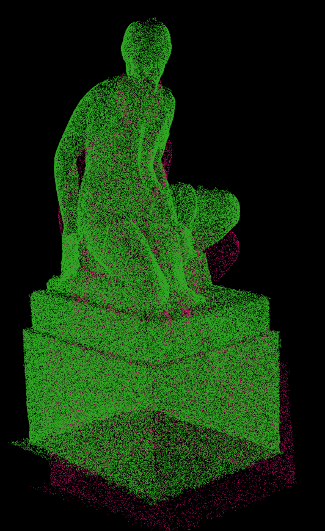 | 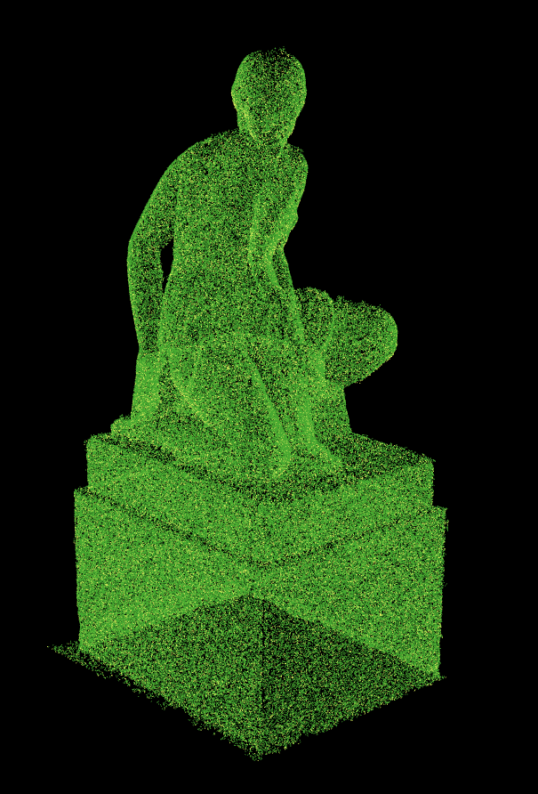 |

## Reference

**direct_lidar_odometry (dlo)** [**Code**: https://github.com/vectr-ucla/direct_lidar_odometry](https://github.com/vectr-ucla/direct_lidar_odometry)